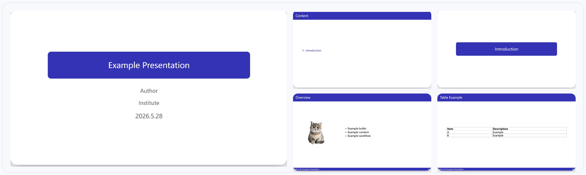

# typst-lab-slides

A lightweight Typst presentation framework optimized for
research-group presentations, technical reports, and academic workflows.

This project is a heavily refactored derivative work inspired by Leonux's Typst slide framework.

## snapshots



---

## Features

* Simple linear writing workflow
* No `deck(...)[ ... ]` body wrapper required
* `#show: setup` global presentation mode
* Lightweight slide DSL
* Chinese typography support
* 16:9 presentation layout
* Built-in title page / TOC / section system
* Two-column and three-column slide helpers
* Lightweight table DSL
* Incremental reveal (`later(...)`) support

---

## Quick Start

### 1. Import template
```
#import "TEMPLATE.typ": *
```
### 2. Enable presentation mode
```
#show: setup
```
### 3. Add title page
```
#tp("My Presentation", "2026.5.28")
```
### 4. Write slides
```
#s("Example Slide")[

* Bullet point
  ]

---
```
## Example
```
#import "TEMPLATE.typ": *

#show: setup

#tp("Example Presentation", "2026.5.28")

#cot("Content")

#sec("Introduction")

#s("Overview")[

* Simple slide DSL
* Typst-based workflow
  ]

#s2(
"Two Column",

[
Left content
],

[
Right content
],
)
```
---

## Philosophy

This framework is designed around:

* low cognitive overhead
* fast research-group iteration
* minimal boilerplate
* readable Typst source
* composable slide primitives
* 
---

## Built-in DSL

### Title page
```
#tp(title, date)
```
### Table of contents
```
#cot(title)
```
### Section page
```
#sec(title)
```
### Single-column slide
```
#s(title)[
...
]
```
### Two-column slide
```
#s2(
title,
left,
right,
)
```
### Three-column slide
```
#s3(
title,
a,
b,
c,
)
```
### Image helper
```
#img(path, width, height)
```
### Table helper
```
#tbl2(
r([A], [B]),
r([C], [D]),
)
```
---

## Attribution

Inspired by Leonux's Typst slide framework.

This project contains substantial modifications and architectural refactoring,
including:

* global show-rule workflow
* simplified authoring model
* positional APIs
* redesigned slide primitives
* Chinese typography support
* presentation ergonomics redesign

---

## License

MIT License.

Please also retain attribution to the original upstream project where appropriate.

